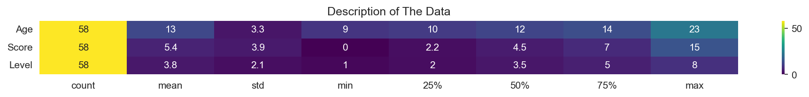
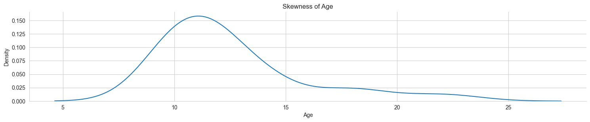
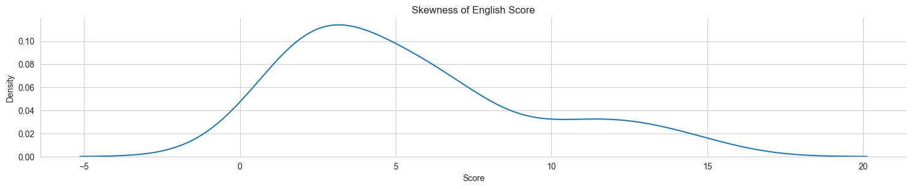
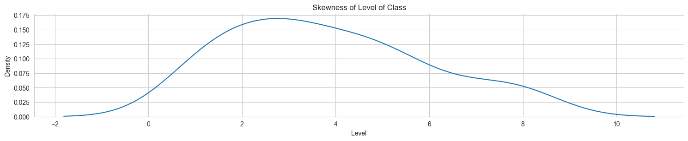
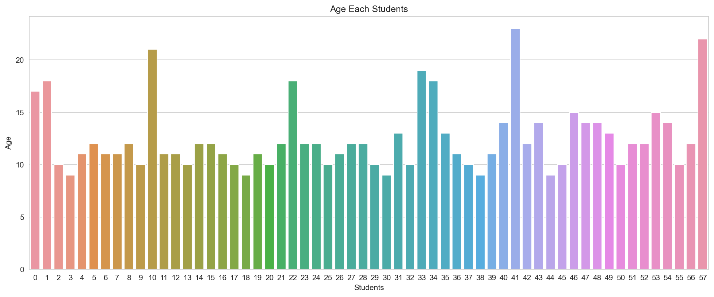
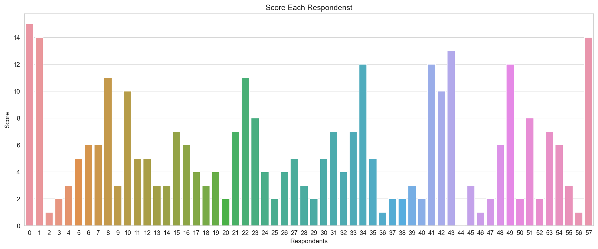
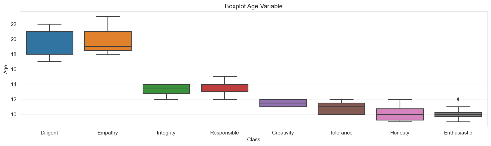
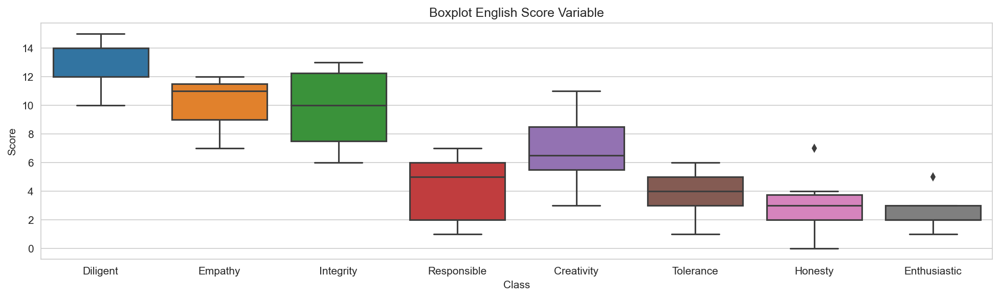
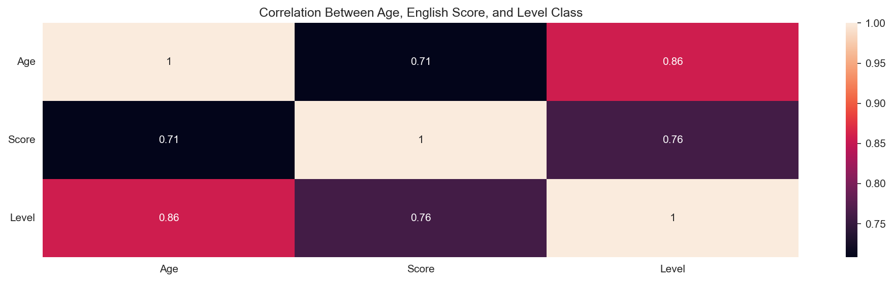
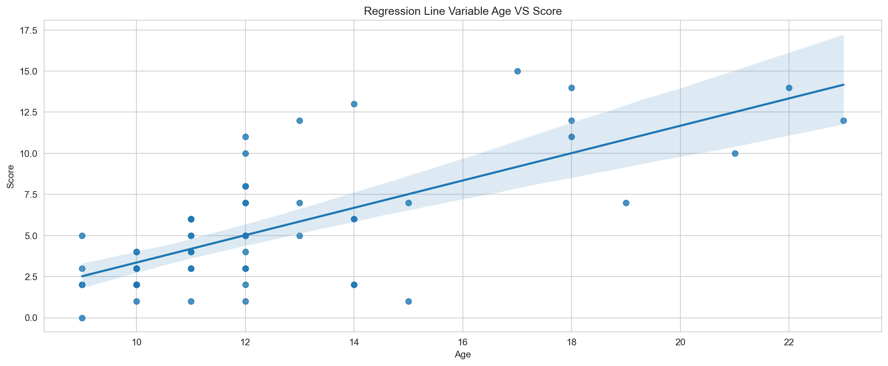

## BACKGROUND

### YAYASAN CIPTA MANDIRI

Yayasan Cipta Mandiri (YCM) is an Independent Creative Foundation for disadvantaged children and youth in Bogor, West Java, Indonesia. Rather than being a traditional academic school, YCM is a rumah pembinaan — a house in which students are able to build their self-confidence, general knowledge, and practical skills.

YCM is for children and youth aged from 9 to 23 who come from underprivileged backgrounds but are motivated to expand their knowledge and to exceed expectations. YCM began as a small facility for only a few children but today, with the invaluable support of sponsors, the foundation has grown to accommodate around 100 active students. YCM is housed in a two storey building which has classrooms, two computer rooms, two sewing rooms, and a kitchen.

YCM was established in 2002 by Mrs. Gesine Nitzschke and Ms. Putu Ayu Novitry Ariany, who shared a common vision for the foundation. The foundation is based on the values of mutual trust, responsibility, teamwork, creativity, and active input. YCM aims to maintain its current high standards, develop its internal systems, and build the capacity of its staff. The foundation is funded entirely through private sponsorship and donations.

### YCM CLASSES

YCM has two types of classes which are English Based Class and Practical Based Class. In English Based Class, they teach English and character building skills, such as critical thinking, independence, confidence, and team-work. In Practical Based Class, they teach IT, Multimedia, Tourism and Guiding, and Sewing.

Students can choose more than one of Practical Based Class if they want. But, English Based Class, they cannot choose more than one. They cannot even choose. The core team choose them which class will fit the students. New students will be tested how excellent their English is before they enter the class.

There are eight level of class for English Based Class, which are Diligent, Empathy, Integrity, Responsible, Creativity, Tolerance, Honesty, and Enthusiastic. Class names are chosen by YCM's philosophy.

### IDENTIFICATION OF PROBLEM

After observing a lot of students, I find some students with good English in the lower class and some students who can develop more in the higher class. I also noticed that there are classes with high variance of age and classes with low variance of age. Based on that issue, I am thrilled to research the issue.

### INSTRUMENTS OF RESEARCH

I used questionnaires to get the English score and the age of the students. There are 16 questions inspired by school test for grade 4 to 6 elementary school.

### SCOPE AND LIMITATION OF PROBLEM

The day I do this research, I can only access the age and the English score. From that, the scope of the research is three variable which are _age_, _english score_, and _level of class_.

There are several variable I want to include, such as _confident level_, _comprehension_, and _communication level_. There are also limitations from this research that don't make that variables happen, such as time, and human resources.

Eventually, This is the result of my research.

## THE EFFECT OF AGE AND ENGLISH SCORE ON LEVEL CLASS IN YAYASAN CIPTA MANDIRI

### LOAD LIBRARY AND DATA


```python
import pandas as pd
pd.set_option('display.max_columns', None)
import numpy as np
import matplotlib.pyplot as plt
import seaborn as sns
sns.set_style('whitegrid')
import statsmodels.api as sm
```


```python
def display(w=16,h=4):
    plt.figure(figsize=(w, h),
               dpi=150)
```


```python
dataset = pd.read_csv('dataset_label.csv')
dataset.head()
```


<div>
<style scoped>
    .dataframe tbody tr th:only-of-type {
        vertical-align: middle;
    }

    .dataframe tbody tr th {
        vertical-align: top;
    }

    .dataframe thead th {
        text-align: right;
    }
</style>
<table border="1" class="dataframe">
  <thead>
    <tr style="text-align: right;">
      <th></th>
      <th>Class</th>
      <th>Name</th>
      <th>Age</th>
      <th>1</th>
      <th>2</th>
      <th>3</th>
      <th>4</th>
      <th>5</th>
      <th>6</th>
      <th>7</th>
      <th>8</th>
      <th>9</th>
      <th>10</th>
      <th>11</th>
      <th>12</th>
      <th>13</th>
      <th>14</th>
      <th>15</th>
      <th>16</th>
      <th>Score</th>
      <th>Level</th>
    </tr>
  </thead>
  <tbody>
    <tr>
      <th>0</th>
      <td>Diligent</td>
      <td>nauffal nur rizky</td>
      <td>17</td>
      <td>1</td>
      <td>1</td>
      <td>1</td>
      <td>1</td>
      <td>1</td>
      <td>1</td>
      <td>1</td>
      <td>1</td>
      <td>1</td>
      <td>0</td>
      <td>1</td>
      <td>1</td>
      <td>1</td>
      <td>1</td>
      <td>1</td>
      <td>1</td>
      <td>15</td>
      <td>8</td>
    </tr>
    <tr>
      <th>1</th>
      <td>Diligent</td>
      <td>muhammad amarif puja adiria</td>
      <td>18</td>
      <td>1</td>
      <td>1</td>
      <td>1</td>
      <td>1</td>
      <td>1</td>
      <td>1</td>
      <td>1</td>
      <td>1</td>
      <td>1</td>
      <td>1</td>
      <td>1</td>
      <td>1</td>
      <td>1</td>
      <td>1</td>
      <td>0</td>
      <td>0</td>
      <td>14</td>
      <td>8</td>
    </tr>
    <tr>
      <th>2</th>
      <td>Tolerance</td>
      <td>adela dzakira aftani</td>
      <td>10</td>
      <td>0</td>
      <td>0</td>
      <td>0</td>
      <td>0</td>
      <td>0</td>
      <td>0</td>
      <td>0</td>
      <td>0</td>
      <td>0</td>
      <td>1</td>
      <td>0</td>
      <td>0</td>
      <td>0</td>
      <td>0</td>
      <td>0</td>
      <td>0</td>
      <td>1</td>
      <td>3</td>
    </tr>
    <tr>
      <th>3</th>
      <td>Honesty</td>
      <td>aretha deandra yusuf</td>
      <td>9</td>
      <td>0</td>
      <td>0</td>
      <td>0</td>
      <td>0</td>
      <td>0</td>
      <td>0</td>
      <td>0</td>
      <td>0</td>
      <td>1</td>
      <td>1</td>
      <td>0</td>
      <td>0</td>
      <td>0</td>
      <td>0</td>
      <td>0</td>
      <td>0</td>
      <td>2</td>
      <td>2</td>
    </tr>
    <tr>
      <th>4</th>
      <td>Honesty</td>
      <td>najla sabria rachmat</td>
      <td>11</td>
      <td>1</td>
      <td>0</td>
      <td>0</td>
      <td>0</td>
      <td>0</td>
      <td>0</td>
      <td>0</td>
      <td>1</td>
      <td>0</td>
      <td>1</td>
      <td>0</td>
      <td>0</td>
      <td>0</td>
      <td>0</td>
      <td>0</td>
      <td>0</td>
      <td>3</td>
      <td>2</td>
    </tr>
  </tbody>
</table>
</div>


```python
df = dataset[['Class', 'Age', 'Score', 'Level']]
```

### EXPLORATORY DATA


```python
describe = df.describe().T
display(h=1)
sns.heatmap(describe, annot=True, cmap='viridis')
plt.yticks(rotation=0)
plt.title('Description of The Data')
plt.show()
```


    

    


There are 58 respondents. 
The age is between 9 to 23 years old with average 13 years old and spread 3.3 from the mean with right skew.
The Score is between 0 to 15 correct answers with average 5.4 correct answers and spread 3.9 from the mean with right skew.
The Level is between 1 to 8 English level with average 3.8 or 4 and spread 2.1 from the mean with still right skew.

From this, I can assume that there is an explanation the skewness from _age_ and _english score_ bring skewness of level class.


```python
sns.displot(data=df, x='Age', kind='kde', height=3, aspect=(5/1))
plt.title('Skewness of Age')
plt.show()
```


    

    


```python
sns.displot(data=df, x='Score', kind='kde', height=3, aspect=(5/1))
plt.title('Skewness of English Score')
plt.show()
```


    

    


```python
sns.displot(data=df, x='Level', kind='kde', height=3, aspect=(5/1))
plt.title('Skewness of Level of Class')
plt.show()
```


    

    


```python
display(h=6)
sns.barplot(data=df, x=df.index, y='Age')
plt.title('Age Each Students')
plt.xlabel('Students')
plt.ylabel('Age')
plt.show()
```


    

    


There are some students looks much older than average students. The range of students is 3 years younger than average students and 3 years older than average students.


```python
display(h=6)
sns.barplot(data=df, x=df.index, y='Score')
plt.title('Score Each Respondenst')
plt.xlabel('Respondents')
plt.ylabel('Score')
plt.show()
```


    

    


There are wide range for English score for the students. That means the students with similar age give different answer for the question.


```python
order_list = ['Diligent', 'Empathy', 'Integrity', 'Responsible', 'Creativity', 'Tolerance', 'Honesty', 'Enthusiastic']
```


```python
display()
sns.boxplot(df, x='Class', y='Age', order=order_list)
plt.title('Boxplot Age Variable')
plt.show()
```


    

    


Boxplot figure tells us the summary of the variety among the dataset. This boxplot tells us the variability of age from every class.

The lower and the upper line tells the minimum and the maximum age. The colored boxes tells where the age of 25% and the 75% students are. The line inside the box tells the area for the age of the 50% students. The black diamond tells the different age from others.


```python
display()
sns.boxplot(df, x='Class', y='Score', order=order_list)
plt.title('Boxplot English Score Variable')
plt.show()
```


    

    


The lower and the upper line tells the minimum and the maximum english score every class. The colored boxes tells 25% and the 75% students reach the english score. The line inside the box tells how many english score of 50% students get. The black diamond tells the different english score from others.


```python
corr = df[['Age', 'Score', 'Level']].corr().round(3)
display()
sns.heatmap(corr, annot=True)
plt.title('Correlation Between Age, English Score, and Level Class')
plt.yticks(rotation=0)
plt.show()
```


    

    


Correlation tells how a variable relates to other variables. The scale of correlation is from -1 to 1. The more it gets closer to 1 or -1, the more they can explain each other. The more it gets closer to 0, the more they don't have any relation each other.


```python
display(h=6)
sns.regplot(data=df, x='Age', y='Score')
plt.title('Regression Line Variable Age VS Score')
plt.show()
```


    

    


Regression tells us whether or not one variable has strong relationship to other variable. From the figure above, it tells us that the older you are, the higher your English score is.

### ANALYSIS DATA


```python
x = df[['Age', 'Score']].values
y = df['Level']
```


```python
x = sm.add_constant(x)
variable = ['CONST','Age', 'Score']
```


```python
model = sm.OLS(exog=x, endog=y).fit()
print(model.summary(xname=variable))
```

                                OLS Regression Results                            
    ==============================================================================
    Dep. Variable:                  Level   R-squared:                       0.781
    Model:                            OLS   Adj. R-squared:                  0.773
    Method:                 Least Squares   F-statistic:                     98.20
    Date:                Wed, 21 Jun 2023   Prob (F-statistic):           7.08e-19
    Time:                        21:09:20   Log-Likelihood:                -81.012
    No. Observations:                  58   AIC:                             168.0
    Df Residuals:                      55   BIC:                             174.2
    Df Model:                           2                                         
    Covariance Type:            nonrobust                                         
    ==============================================================================
                     coef    std err          t      P>|t|      [0.025      0.975]
    ------------------------------------------------------------------------------
    CONST         -2.2198      0.578     -3.839      0.000      -3.379      -1.061
    Age            0.4112      0.057      7.158      0.000       0.296       0.526
    Score          0.1684      0.049      3.445      0.001       0.070       0.266
    ==============================================================================
    Omnibus:                        0.864   Durbin-Watson:                   2.472
    Prob(Omnibus):                  0.649   Jarque-Bera (JB):                0.957
    Skew:                          -0.242   Prob(JB):                        0.620
    Kurtosis:                       2.597   Cond. No.                         63.1
    ==============================================================================
    
    Notes:
    [1] Standard Errors assume that the covariance matrix of the errors is correctly specified.
    


```python
print(f'the {(1-model.rsquared_adj).round(3)*100} % can be explained by variables I do not research, such as confident level and comprehension.')
```

    the 22.7 % can be explained by variables I do not research, such as confident level and comprehension.
    

There are lots of stuff going on here. The dependend variable is level of class. The method I used is Ordinal Least Squares. This data is processed on Wed, 21 Jun 2023 at 21:09:20. There are 58 observations and the degree of freedom is 55. There are two independent variables. I use adjusted R squared with score 0.773 because of using more than one variable.

The variable age has a significant effect on level of class, proven with a value of 0.000 on P>|t| which is lower than 0.05. The variable English score has a significant effect on level of class, proven with a value of 0.001 on P>|t| which is lower than 0.05.

The coefficient of age is 0.4112 which means every 1 point of age will affect level of class around 0.4112. The coefficient of English score is 0.1684 which means every 1 point of English score will affect level of class around 0.1684.

### CONCLUSION AND IMPROVEMENT

The level of class can be explained by age and English score about 77.3% and 22.7% can be explained by variables I do not research. Age and English score have significant effect on level of class.

This research is not perfect. There is still space to improve the research. Adding more respondents or more variable can be one of them.

### CLOSING

This research is aimed to give a global view of the students. There are some part I want to talk more like the variety of English score. Some classes has similar students and some has huge variety.

I am not alone doing it. A lot of hands make this happen.

Thanks to Pak Kohar that lets me do this awesome project with students.
Thanks to Kak Ono that helps me explain to core team and other tutors about my project.
Thanks to Ani that always inspires me. Let's make bigger project next time.
Thanks to Naufal, Sinta, and Erik that motivates me to finish this project. For Sinta, your EXCEL is EXCEL(lent).
Thanks to all students that gives me time and efford to fill the questionnaires.
